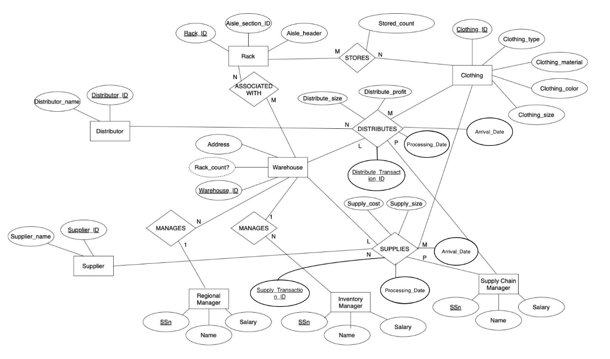
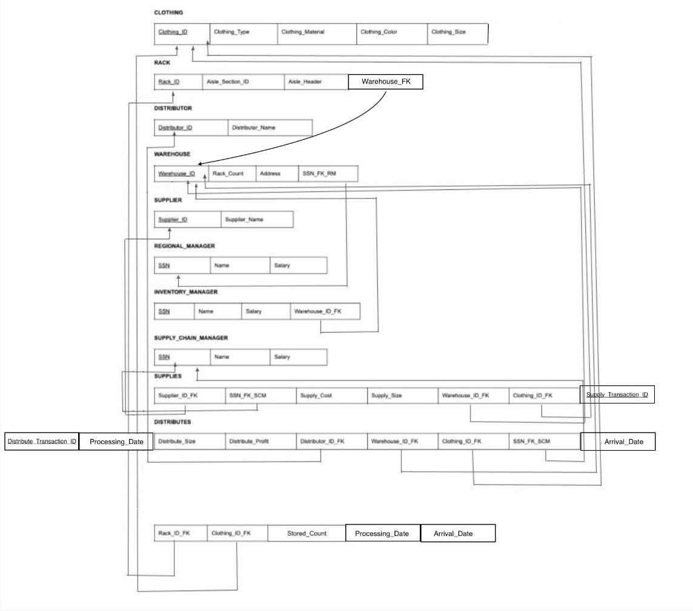

# Warehouse Management System

**Course:** CS 4347 - Database Systems\
**Semester:** Spring 2025\
**Project:** Warehouse Management System - Clothing and Apparel\
**Language:** JavaScript

## Overview

Manual or disjointed warehouse systes lead to inventory inaccuracies, delayed shipments, and miscommunication between suppliers and distributors. Inaccurate inventory causes delays, lost revenue, and frustrated customers. This project seeks to streamline inventory and supply chain operations by building a data-driven warehouse management system that ensures accuracy, reduces costs, and boosts efficiency. Our warehouse management system simulates a regional clothing distribution network and approaches the aforementioned problem by keeping operations accurate and reliable by connecting suppliers, warehouses, racks, and distributors in one smooth flow. Every item is tracked with precision, reducing errors and providing real-time inventory visibility. 

## Business Rules

* Suppliers provide clothing to warehouses through a Supply transaction (tracked by a Supply Chain Manager)
* Warehouses store clothing in Racks, on a unique Aisle section and Warehouse
* Inventory Managers oversee clothing items inside the warehouse
* Regional Managers are linked and supervise multiple warehouses
* Distributors receive clothing from warehouses via Distribute transaction (managed by a Supply Chain Manager)
* Every transaction (supply or distribute) includes processing and arrival dates, item counts, and cost or profit details.

## Entity Relationship Model



## Relational Model



## How to Run

* Place ```simulation.txt``` in the project root directory.
* Compile: ```javac *.java```
* Run: ```java Main```

## Possible Extensions

* Input Validation & Data Encryption of Employee Information
* Authentication System & Access Control
* Real-Time Inventory Tracking (RFID)
