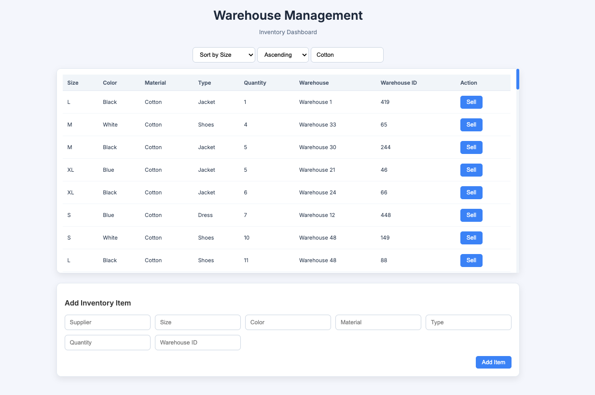
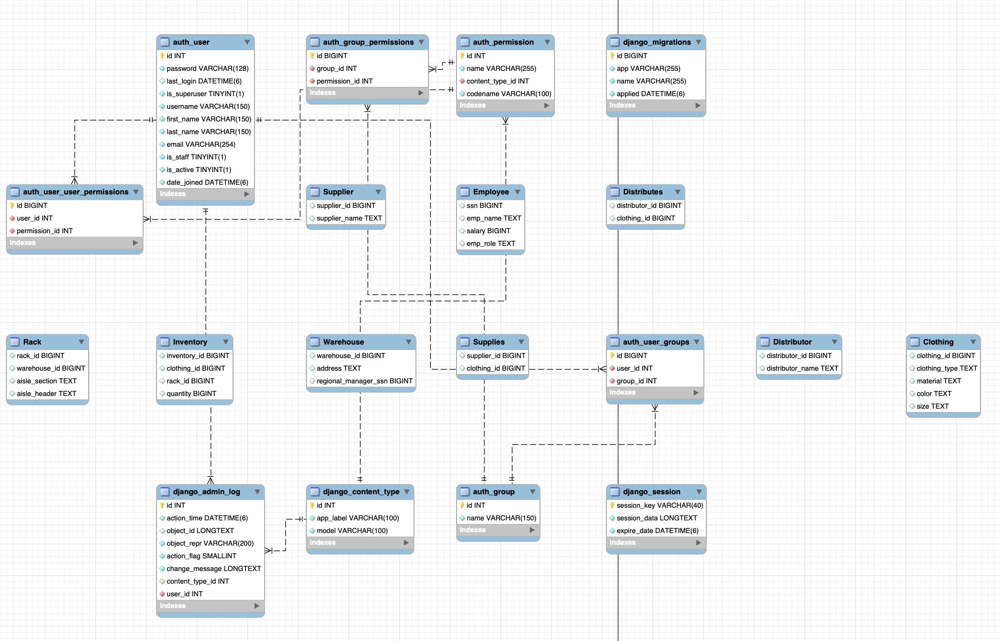

# Warehouse Management System

**Course:** CS 4347 - Database Systems\
**Semester:** Spring 2025\
**Project:** Warehouse Management System - Clothing and Apparel\
**Languages:** Django, Python, MySQL, HTML/CSS

## Overview

Manual or disjointed warehouse systes lead to inventory inaccuracies, delayed shipments, and miscommunication between suppliers and distributors. Inaccurate inventory causes delays, lost revenue, and frustrated customers. This project seeks to streamline inventory and supply chain operations by building a data-driven warehouse management system that ensures accuracy, reduces costs, and boosts efficiency. Our warehouse management system simulates a regional clothing distribution network and approaches the aforementioned problem by keeping operations accurate and reliable by connecting suppliers, warehouses, racks, and distributors in one smooth flow. Every item is tracked with precision, reducing errors and providing real-time inventory visibility. 




## Business Rules

* **Employees and Management:** Regional Managers oversee multiple warehouses, while Inventory and Supply Chain Managers handle inventory and supply/distribution operations.
* **Warehouses and Racks:** Warehouses store clothing in racks, each uniquely identified and organized by aisle section and header.
* **Clothing and Inventory:** Clothing items are tracked by type, material, color, and size. Inventory links clothing to racks and records available quantities.
* **Suppliers and Supplies:** Suppliers provide clothing items to warehouses. The many-to-many relationship is tracked in the Supplies table.
* **Distributors and Distribution:** Distributors receive clothing from warehouses. The many-to-many relationship is tracked in the Distributes table.
* **Transaction Tracking:** All supply and distribution operations should record processing and arrival dates, item counts, and cost or profit details.

## Enhanced Entity Relationship Model



## How to Run

1. Clone Repository

```
git clone https://github.com/jayne-s/Warehouse-Management-System.git
cd wms_project
```

2. Create Virtual Environment

```
python -m venv venv
source venv/bin/activate
```

3. Install Dependencies

```
pip install -r requirements.txt
```

4. Setup MySQL Database

Open MySQL Workbench and run:
```
SOURCE setup.sql;
```

5. Configure Database Variables

Set the Database Name, Username, Password, Host, and Port.

6. Run Server

```
python manage.py runserver
```

Visit: ``` http://127.0.0.1:8000/```

## Possible Extensions

* Input Validation & Data Encryption of Employee Information
* Authentication System & Access Control
* Real-Time Inventory Tracking (RFID)
